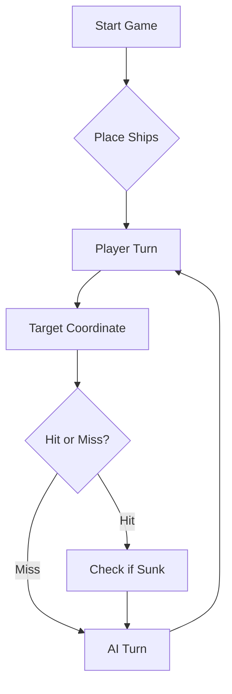

# ⚓ Battleship 2.0


> A modern take on the classic naval warfare game, designed for the XVII century setting with updated software engineering patterns.

---

## 📖 Table of Contents
- [Group Members](#group-members)
- [Youtube Links](#youtube-links)
- [Project Overview](#-project-overview)
- [Key Features](#-key-features)
- [Technical Stack](#-technical-stack)
- [Installation & Setup](#-installation--setup)
- [Documentation](#-documentation)
- [Phase 6 — Distribution & Operations](#-phase-6--distribution--operations)
- [Roadmap](#-roadmap)
- [Testing](#-testing)
- [Contributing](#-contributing)
- [License](#-license)

---

# Project — Group: **TP07-PL-2**

## Group Members

| Course | Nº | Name | Nickname |
|---|---|---|---|
| LIGE-PL | 123774 | Ana Comparada Reganha | anacomparada |
| LIGE-PL | 93263 | Diogo Soares | IGE-93262, dpsoares |
| LIGE-PL | 123762 | Rodrigo Couceiro | IGE-123762 |
| LIGE-PL | 111561 | Tiago Bensusan | IGE-111561 |

---

## Youtube Links

### Video 1 - com issues implementados: https://www.youtube.com/watch?v=vr6FnVwU7dA
[](https://www.youtube.com/watch?v=vr6FnVwU7dA)

### Video 2 - jogar contra LLM: https://www.youtube.com/watch?v=bzIJOWg98pI
[](https://www.youtube.com/watch?v=bzIJOWg98pI)

---

## 🎯 Project Overview
This project serves as a template and reference for students learning **Object-Oriented Programming (OOP)** and **Software Quality**. It simulates a battleship environment where players must strategically place ships and sink the enemy fleet.

### 🎮 The Rules
The game is played on a grid (typically 10x10). The coordinate system is defined as:

$$(x, y) \in \{0, \dots, 9\} \times \{0, \dots, 9\}$$

Hits are calculated based on the intersection of the shot vector and the ship's bounding box.

---

## ✨ Key Features
| Feature | Description | Status |
| :--- | :--- | :---: |
| **Grid System** | Flexible $N \times N$ board generation. | ✅ |
| **Ship Varieties** | Galleons, Frigates, and Brigantines (XVII Century theme). | ✅ |
| **AI Opponent** | Heuristic-based targeting system. | 🚧 |
| **Network Play** | Socket-based multiplayer. | ❌ |

---

## 🛠 Technical Stack
* **Language:** Java 17
* **Build Tool:** Maven / Gradle
* **Testing:** JUnit 5
* **Logging:** Log4j2

---

## 🚀 Installation & Setup

### Prerequisites
* JDK 17 or higher
* Git

### Step-by-Step
1. **Clone the repository:**
   ```bash
   git clone https://github.com/britoeabreu/Battleship2.git
   ```
2. **Navigate to directory:**
   ```bash
   cd Battleship2
   ```
3. **Compile and Run:**
   ```bash
   javac Main.java && java Main
   ```

---

## 📚 Documentation

You can access the generated Javadoc here:

👉 [Battleship2 API Documentation](https://anacomparada.github.io/Battleship2/)

### Core Logic
```java
public class Ship {
    private String name;
    private int size;
    private boolean isSunk;

    // TODO: Implement damage logic
    public void hit() {
        // Implementation here
    }
}
```

### Design Patterns Used:
- **Strategy Pattern:** For different AI difficulty levels.
- **Observer Pattern:** To update the UI when a ship is hit.

### Logic Flow


---

## 🐳 Phase 6 — Distribution & Operations

### What We Did

In this phase, the group implemented a complete CI/CD pipeline integrating multiple tools and services:

- **Docker** — created a multi-stage `Dockerfile` to compile and package the Battleship project into a Docker image, avoiding the need to include the JAR in the repository.
- **Docker Hub** — the image is automatically published to Docker Hub on every push to the `main` branch.
- **SonarQube Cloud** — integrated code quality analysis with a Quality Gate into the pipeline.
- **GitHub Pages** — Javadoc documentation is automatically generated and published online.
- **SnapDeploy** — the Docker image runs in the cloud and is publicly accessible.
- **GitHub Actions** — created the `completeWorkflow.yaml` workflow that orchestrates all the above steps sequentially and automatically.

### 🌍 Live Application

👉 The game is publicly accessible at: we had an error in the deploying phase.

### Errors Found and Fixed

During implementation, several issues arose that we resolved iteratively:

| # | Error | Fix |
|---|---|---|
| 1 | SonarQube missing `sonar.projectKey` and `sonar.organization` | Added the values via GitHub secrets |
| 2 | Duplicate `sonar.projectKey` in YAML generated by LLM | Removed the duplicate line |
| 3 | Secrets with literal incorrect values | Edited secrets with correct values from SonarCloud |
| 4 | Automatic Analysis active in SonarCloud conflicting with CI | Disabled in *Administration → Analysis Method* |
| 5 | `sonar.java.binaries` not defined | Added `-Dsonar.java.binaries=target/classes` to scanner args |
| 6 | Quality Gate failing | Added `continue-on-error: true` while issues are progressively fixed |
| 7 | GitHub Actions missing write permissions for GitHub Pages | Enabled *Read and write permissions* in *Settings → Actions → General* |
| 8 | JAR not found in SnapDeploy (`target/` is in `.gitignore`) | Rewrote `Dockerfile` using multi-stage build so Maven compiles inside the image |

### Group Participation

All group members actively participated in this phase, contributing to identifying and resolving errors, configuring external services (Docker Hub, SonarCloud, SnapDeploy), and integrating the CI/CD pipeline.

---

## 🗺 Roadmap
- [x] Basic grid implementation
- [x] Ship placement validation
- [x] Docker containerization
- [x] CI/CD pipeline with GitHub Actions
- [x] SonarQube Cloud integration
- [x] GitHub Pages documentation
- [x] Cloud deployment via SnapDeploy
- [ ] Add sound effects (SFX)
- [ ] Implement "Fog of War" mechanic
- [ ] **Multiplayer Integration** (High Priority)

---

## 🧪 Testing
We use high-coverage unit testing to ensure game stability. Run tests using:
```bash
mvn test
```

> [!TIP]
> Use the `-Dtest=ClassName` flag to run specific test suites during development.

---

## 🤝 Contributing
Contributions are what make the open-source community such an amazing place to learn, inspire, and create.

1. Fork the Project
2. Create your Feature Branch (`git checkout -b feature/AmazingFeature`)
3. Commit your Changes (`git commit -m 'Add some AmazingFeature'`)
4. Push to the Branch (`git push origin feature/AmazingFeature`)
5. Open a **Pull Request**

---

## 📄 License
Distributed under the MIT License. See `LICENSE` for more information.

---
**Maintained by:** [@britoeabreu](https://github.com/britoeabreu)  
*Created for the Software Engineering students at ISCTE-IUL.*
